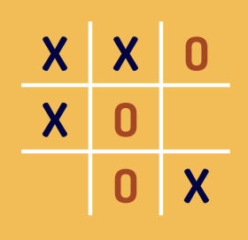
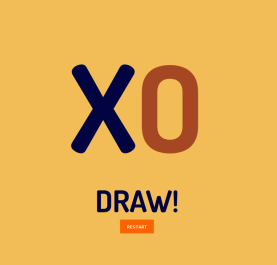

# Tic Tac Toe

A game where two players can play tic tac toe on the same computer.
The computer will detect when they win.

## [Play Working Demo](https://lemieba.github.io/tictactoe/)

## Features

- Minimum requirement
  - [x] It has to have a the tic tac toe table.
  - [x] first player will be x and second player will be o.
  - [x] when an empty grid is clicked the current player's x or o will be shown onto that grid and the current player will switch. 
  - [x] a non empty grid should no be clicked or switched.
  - [x] As the game goes on after every click check if this click creates a winner.

- Be cool to have
  - [x] It has to look good.
    - [x] Add typography to X and O
    - [x] Add styling to board
    - [x] Add title.
  - [x] Add winner view.

### Play Pages

### Possible result Pages

